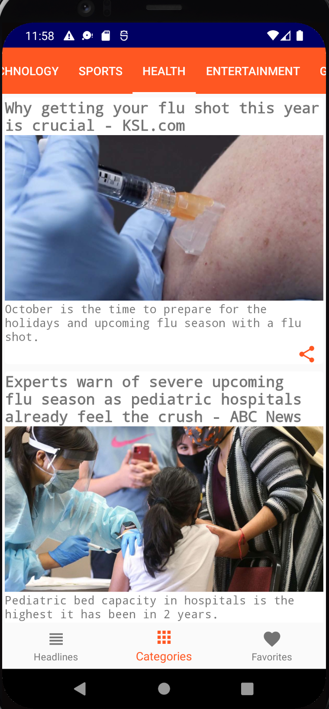

# NEWSMANIAC-NEWS-APP-ANDROID
## Project Overview
This app provides you with news headlines happening around the world,with options to select specific country and news categories from [NewsApi.org](http://newsapi.org/)

## Screenshots

<table>
<tr>
<td>

 

 </td>
 <td>

 

 </td>
   <td>

  

  </td>
    <td>
    
 
  </td>
    <td>

  </td> 
    <td>

  </td> 
  </tr>
<tr>
<td>

 </td>
 <td>

 </td>
    <td>

  </td> 
  </tr>
</table>

### You can get your API_KEY from [NewsApi.org](http://newsapi.org/)
# Features
* Users can check headlines from specific country or category.
  Choose from available countries/regions: Germany, USA, Singapore, Australia, New-Zealand, India, 
  Hongkong, Netherlands, Taiwan, Great-Britain, France, South-Africa
* User can share headline Url with friends
* User can mark a headline as Favorite and view offline
* Users can search for any topic
* App languages currently supported: german, english, french, netherlands, simplified chinese

